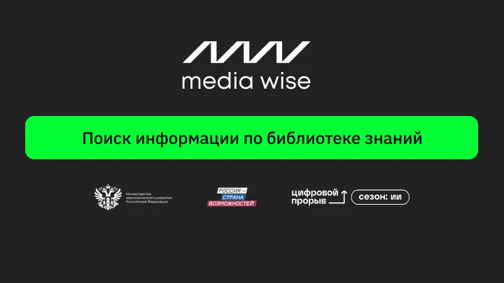

# 📚 Knowledge Base Search Chatbot for Advertising Agencies

<p style="text-align: center;">
   
</p>

Welcome to the **Knowledge Base Search Chatbot**, an intelligent solution tailored for **[Media Wise](https://mediadirectiongroup.ru/agency/mediawise/)**. Integrated seamlessly into Telegram, this chatbot empowers advertising professionals to access precisely the information they need, along with direct links to relevant documents. The bot also supports real-time updates, allowing users to expand the knowledge base with new files, keeping resources fresh and comprehensive.

## ✨ Key Features

- **🔍 Quick & Accurate Search with Direct Links**  
  Instantly find and access relevant information across extensive repositories. Each search result includes a direct link to the requested document, allowing users to quickly open and utilize the information.

- **📥 Real-Time Database Expansion**  
  Easily upload new files to the knowledge base through the Telegram mini-app. This ensures that all important resources are available and up-to-date for ongoing campaigns and strategic planning.

- **🏆 Performance Metrics & Leaderboard**  
  Track search accuracy, user engagement, and efficiency with built-in metrics. A leaderboard highlights top users, making the search process interactive and motivating.

## 🛠️ Solution Overview

In the fast-paced world of advertising, quick access to information is essential. This Telegram-based chatbot revolutionizes how **Media Wise** teams find and interact with their knowledge base, allowing them to focus on creativity and strategy. By providing direct links to the requested documents and supporting real-time file uploads, this tool ensures teams always have the right resources at their fingertips.

## 🚀 Demo


**[Try the Telegram Demo](https://t.me/mock_knowledge_base_bot)**

Experience the chatbot firsthand! Enter your query, and the bot will retrieve direct links to relevant documents from the knowledge base in seconds. Key strengths:
- **Seamless Access**: Provides direct links for immediate access to documents, streamlining workflow.
- **Continuous Database Growth**: Easily add new files, ensuring the knowledge base grows alongside the team’s needs.
- **Engagement & Productivity**: Performance metrics and a leaderboard foster a collaborative, efficient work environment.

## 🚀 Quick Start

1. **Clone the Repository**  
   ```bash
   git clone https://github.com/Baltsat/Users-knowledge-search.git
   ```
2. **Install Dependencies**  
   Ensure Python 3.10+ is installed, then run:
   ```bash
   pip install -r requirements.txt
   ```
3. **Configure Telegram Bot**  
   Register a bot on Telegram via [BotFather](https://core.telegram.org/bots#botfather) and get your API token. Set it up as an environment variable:
   ```bash
   export TELEGRAM_TOKEN="your-telegram-bot-token"
   ```
4. **Launch the Bot**  
   Start the bot with:
   ```bash
   python bot.py
   ```

## ⚙️ Functional Workflow

- **Smart Search with Direct Access Links**  
  Users enter search queries directly into the Telegram bot. For each query, the bot provides a list of relevant documents along with direct links, enabling instant access to the required resources.

- **Easy Uploads for Database Expansion**  
  Need to add new documents? Upload files directly in the Telegram chat to continuously grow and update the knowledge base, keeping information relevant and accessible.

- **Tracking & Engagement**  
  Keep an eye on retrieval speed, relevance, and user engagement. The leaderboard adds a bit of friendly competition, making the search experience enjoyable and engaging.

## 📊 Key Metrics

| Metric              | Description                                       | Target       |
|---------------------|---------------------------------------------------|--------------|
| **Retrieval Speed** | Time taken to return search results               | < 1 second   |
| **Search Relevance**| Accuracy and relevance of retrieved documents     | High         |
| **User Engagement** | User activity levels and leaderboard standings    | Top 10%      |

## 🔗 API Documentation

This bot uses a Django REST API to handle interactions with the knowledge base.

### Endpoints

1. **Search `/api/search`**  
   - `GET`: Retrieve documents based on a search query, with each result including a direct link to the document.

2. **Upload `/api/upload`**  
   - `POST`: Add a new document to the knowledge base, enabling users to keep resources updated.

### Data Structure
Each document in the API includes:
- `title`: The document or presentation title.
- `type`: File type (e.g., text, presentation).
- `upload_date`: Date of addition.
- `tags`: Keywords to enhance search relevance.

## 🌟 Installation & Launch

To get the chatbot up and running:

1. Clone the repository:  
   ```bash
   git clone https://github.com/Baltsat/Users-knowledge-search.git
   ```
2. Create a virtual environment and activate it.
3. Install dependencies:  
   ```bash
   pip install -r requirements.txt
   ```
4. Apply database migrations:  
   ```bash
   python manage.py migrate
   ```
5. Run the server:  
   ```bash
   python manage.py runserver
   ```

## 🔍 Example API Requests
- **Search Query**  
  ```
  GET http://localhost:8000/api/search?query=campaign+strategy
  ```
- **File Upload**  
  ```
  POST http://localhost:8000/api/upload
  ```

## 👥 Meet the Team

Our talented team is here to bring this solution to life:

| Name               | Role                 | Contact                        |
|--------------------|----------------------|--------------------------------|
| Konstantin Baltsat | ML         | [t.me/BALTSAT](https://t.me/BALTSAT) |
| Igor Din        | Fullstack         | [t.me/dmdin](https://t.me/dmdin) |
| Sakhnevich Kirill  | ML          | [t.me/SakhnevichKirill](https://t.me/SakhnevichKirill) |
| Artem Sosedka            | ML          | [t.me/sostema](https://t.me/sostema) |

---

This chatbot brings efficiency and simplicity to Media Wise’s information retrieval process, making data access faster and easier than ever. With a powerful Telegram mini-app at your disposal, your team can make informed decisions, stay engaged, and maintain an ever-growing knowledge base—all in one place. Ready to unlock a new level of productivity? Get started with the Knowledge Base Search Chatbot today!

